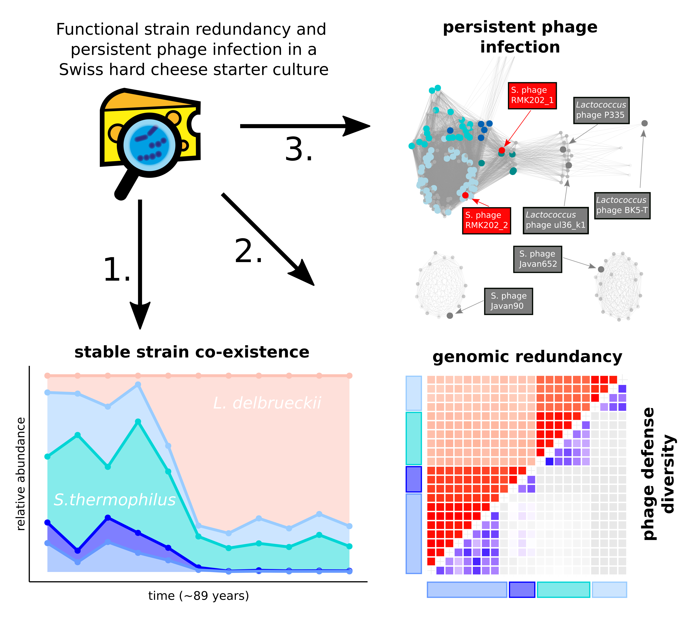

# **Analysis pipeline: Functional strain redundancy and persistent phage infection in a Swiss hard cheese starter culture**

This is the script repository for the following manuscript:

Somerville, Vincent, Berthoud, Hélène, Schmidt, Remo S., Bachmann, Hans-Peter, Meng, Yi Hélène, Fuchsmann, Pascal, von Ah, Ueli, Engel, Philipp. 2021. “Functional strain redundancy and persistent phage infection in a Swiss hard cheese starter culture.” *BioRXiv*

## Abstract

Undefined starter cultures are bacterial communities used in cheese making. They are phenotypically stable and propagated under constant conditions in milk. This makes them interesting to understand the eco-evolutionary dynamics of microbial communities. While cheese starter cultures are known to be dominated by a few bacterial species, little is known about the composition, functional relevance, and temporal dynamics of strain-level diversity. Here, we applied shotgun metagenomics to analyze historical samples spanning 22 years and continuous propagation for 123 generations of an important Swiss cheese starter culture. We found that the bacterial community is highly stable and dominated by two species, *Streptococcus thermophilus* and *Lactobacillus delbrueckii subsp. lactis*. Each species is represented by a few coexisting strains. Genome sequencing, metabolomics analysis, and co-culturing experiments show that these strains are functionally redundant, but differ tremendously in their phage resistance potential. Moreover, we identified two highly abundant *Streptococcus* phages that seem to stably coexist in the community without any negative impact on bacterial growth or strain persistence, and despite the presence of a large diversity of matching CRISPR spacers. Our findings provide novel insights into strain-level diversity in domesticated microbial communities and highlight an important role of bacteria-phage interactions in cheese starter cultures.  

## Script overview

The scripts are divided into three subscripts. Each on is saved and compiled as a Rmarkdown with extensive comments. The three parts consist of:

1. the general analysis including all genomic and non-genomic data-analysis
2. the plotting and analysis for the main body figures
3. the plotting and analysis for the supplemental figures

## Data availability

All data is stored on zenodo under the following doi:

10.5281/zenodo.4431629

The genomic data is further stored under the following Bioprojects:

- PRJNA589532
- PRJNA589608
- PRJNA659704

## Disclaimer

The analysis pipeline presented here should be complete however it has not been created as a standalone script. The purpose of the paper was not to generate a tool. Many dependencies are expected.
